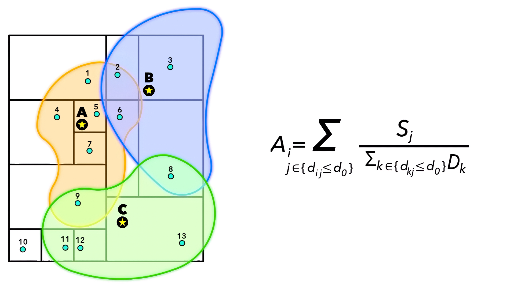

# 充电站错配指数M(F)：2SFCA重构

本版把核心计算指标从"空间置换LP+时间排队M/M/c"改为“两步移动搜索可达性G2SFCA+i2SFCA”：原双口径在时间排队曲线如果不优化的话会出现优化后曲线断崖下降，但优化了的话其时间成本中包括排队时间和路上时间会与空间置换口径互相冗余。而我们的数据只有充电站快慢充桩数，做不出用户均衡、双层规划等所需的参考数据。2SFCA方法只依赖"供给容量+需求+距离"，恰好匹配我们的数据，而且是空间供需错配领域（比如绿地可达性[The relationship between green space accessibility by multiple travel modes and housing prices: A case study of Beijing - ScienceDirect](https://www.sciencedirect.com/science/article/pii/S0264275123005061)）的常用方法，稳健、参数少。

[[KAIST CCS Mobility\] Master's Thesis Defense | Ms. Songmi Baek](https://www.youtube.com/watch?v=EmoIA9DWFSE)

## 0.符号

| 符号 | 含义 | 来源 |
|---|---|---|
| $D,i\in D$ | 需求点集合（路网节点中心；haversine回退用0.01°网格） | 轨迹→SoC→低电量需求 |
| $w_i$ | 点$i$一日期望低电量充电需求量 | 蒙特卡洛需求模拟 |
| $F,j\in F$ | 开放站集合 | 已有站点表 |
| $n_j^{\text{fast}},n_j^{\text{slow}}$ | 站$j$快/慢桩数 | 已有 |
| $d_{ij}$ | 点$i$到站$j$的路网最短路距离 | OSMnx自建图 |
| $\bar{C}$ | 低电量车最大可达里程 | 自定义参数；基准100km |
| $\gamma$ | 快/慢桩有效容量比 | 自定义参数；≈10 |
| $\kappa_j$ | 站$j$有效容量 $=\gamma n_j^{\text{fast}}+n_j^{\text{slow}}$ | 自定义参数 |
| $s,b_j$ | 容量换算系数与需求量单位容量$b_j=s\kappa_j$ | 含自定义参数$u$ |
| $u$ | 系统利用率 = 总需求/总容量 | 自定义参数；基准1 |
| $d_0$ | 高斯距离衰减参数 | 自定义参数 |
| $G_{ij}$ | 高斯距离衰减权重 | 式(2) |
| $p_{ij}$ | Huff方程求需求$i$分配到站$j$的比例 | 式(3) |
| $L_j,C_j$ | 站负载、i2SFCA拥挤度 | 式(4)(5) |
| $A_i$ | 点$i$的G2SFCA可达性 | 式(6) |
| $P_{\text{dead}}$ | 单位需求得不到服务的惩罚（km） | 自定义参数 |
| $d_{\text{ref}}$ | 拥挤代价的km标尺（基线需求加权最近站距离） | 自定义参数 |
| $\beta$ | 拥挤代价系数 | 自定义参数 |

---

## 1.站点有效容量 与 需求量换算

快充桩单位时间服务的车比慢充桩多，按充电功率比 γ 给快桩加权，定义站点 j 有效容量 κ_j ：

$$
\kappa_j=\gamma\,n_j^{\text{fast}}+n_j^{\text{slow}} \tag{1}
$$

低电量车在快充约 25–40 min 充好（≈2 辆/h），慢充要数小时（≈0.2 辆/h），本文γ取值=10，并作敏感性测试。

| 来源                                                         | 快慢充参数                                                   | 比值                                                         |
| ------------------------------------------------------------ | ------------------------------------------------------------ | ------------------------------------------------------------ |
| **Nature Communications, 2025**，Hanig et al., *Finding gaps in the national electric vehicle charging station coverage of the United States*。([Nature](https://www.nature.com/articles/s41467-024-55696-8)) | 慢充：Level 2 = 5–19.2 kW；快充：DCFC = 50–350 kW。          | 按功率直接折算：最低 50/19.2=2.60，最高 350/5=70.00。        |
| **Journal of Energy Storage, 2025**，Mojlish et al., *Impacts of ultra-fast charging of electric vehicles on power grids*。该刊 2024 年 JCR/SJR 均为 Q1。([ScienceDirect](https://www.sciencedirect.com/science/article/pii/S2352152X24044992)) | 慢充：Level 2 AC = 3.1–19.2 kW，7–10 h；快充：Level 3 DC = 50–250 kW，30 min。 | 按功率：(50/19.2=2.60) 到 (250/3.1=80.65)。按时间服务率：(7/0.5=14) 到 (10/0.5=20)。 |
| **Sustainable Cities and Society, 2025**，Rajabi et al., *Strategic deployment of Level-2 charging infrastructure…*。([ScienceDirect](https://www.sciencedirect.com/science/article/pii/S2210670725003919)) | 慢充：Level 2 = 4–8 h full charge；快充：DCFC = 30 min or less to 80%。 | 按服务时间：(4/0.5=8) 到 (8/0.5=16)。                        |

---

需求量 $w_i$ 代表的是每日低电量充电需求（单位为车辆频次）， $\kappa_j$ 的单位为等效的充电桩数量，需要统一度量单位。设比例常数 s 为一个等效桩在城市各处每天需要消化的需求量（容量换算系数），$u$ 为系统利用率=总需求/总容量，$b_j$ 为充电站 $j$ 经过系数换算后与需求量处于同一个度量单位下的有效容量。

$$
b_j=s\,\kappa_j,\qquad s=\frac{\sum_iw_i}{u\,\sum_j\kappa_j} \tag{1'}
$$
基准$u=1$（代表容量刚好等于需求的压力情景；暴露空间上竞争最集中在哪里）。做增删站分析时$s$固定用baseline集计算避免新增删站反影响。

---

## 2.错配指数 M(F)

### 2.1距离衰减与需求分配

高斯距离衰减：

$$
G_{ij}=\exp\!\Big[-\frac{1}{2}\big(\frac{d_{ij}}{d_0}\big)^2\Big]\,\mathbf{1}[\,d_{ij}\le\bar{C}\,]. \tag{2}
$$

Huff模型计算需求$i$按"容量×衰减"摊到各可达站：
$$
p_{ij}=\frac{b_j\,G_{ij}}{\sum_{k}b_k\,G_{ik}},\qquad\text{reach}_i=\mathbf1\big[\exists\,k:d_{ik}\le\bar{C}\big].\tag{3}
$$
**标准化 $\frac{d_{ij}}{d_0}$ 防止上溢和下溢。**直接用高斯方程的$\exp$计算会在较小时趋近于0把可达点误判为抛锚，较大时指数爆炸。代码计算时先取对数然后减去最大值后再softmax: 
$$
p_{ij} = \frac{\exp(\text{logit}_{ij} - M_i)}{\sum_k \exp(\text{logit}_{ik} - M_i)},\qquad \text{logit}_{ij}=\text{log}(b_j\,G_{ij})=-\frac{1}{2}\big(\frac{d_{ij}}{d_0}\big)^2+\ln b_j,\qquad M_i = \text{max}_{k} \text{logit}_{ik}.\tag{3'}
$$
 可达性由低电量车最大可达里程$\bar{C}$单独判定; $d_0\to0$时$p$集中到最近站。

### 2.2 站负载与i2SFCA拥挤度

$$
L_j=\sum_iw_i\,p_{ij},\qquad C_j=\frac{L_j}{b_j}.\tag{4}
$$

$C_j$为i2SFCA拥挤度，每单位容量摊到的潜在需求，$C_j>1$表示该站在需求分配下过满容量了。它从供给侧度量竞争强度刻画拥堵量。

拥挤代价（拥挤度折成km）：
$$
\sigma(C_j)=\beta\,d_{\text{ref}}\Big(1-\frac{1}{C_j}\Big)\,\mathbf1[C_j>1],\qquad 1-\frac{1}{C_j}=\frac{L_j - b_j}{L_j},\text{(超容量溢出比例)}. \tag{5}
$$
我们将充电站拥挤建模为一种有界的“超容量溢出比例×改道距离”惩罚。电动汽车充电可达性与排队研究通常使用system utilization（Liu et al., 2022; Varshney et al., 2025）、queueing（Liu et al., 2022; Yang et al., 2021）、waiting time（Yang et al., 2021; Dastpak et al., 2024）和detour distance（Yang et al., 2021; Dastpak et al., 2024）来作为用户选择和可达性成本的一部分，当 $C_j \le 1$ 时，分配需求可以被容量容纳，因此不施加溢出惩罚；当$C_j > 1$  时，$1-\frac{1}{C_j}=\frac{L_j - b_j}{L_j}$ 可被解释为无法由首选站点直接服务的溢出需求比例，这部分需求会面临等待、放弃排队或被迫改道至其他站点。类似地，排队模型中 $\rho>1$ 代表到达率超过服务能力，常规稳态排队延迟公式难以稳定解释（Liu et al., 2022）。我们用$d_{\text{ref}}$对该溢出比例的影响进行量化表示成额外出行代价，其中$d_{\text{ref}}$定义为基准情景下所有需求点到最近充电站的平均距离，如果某个首选站点超容量，溢出的那部分需求不再被假定产生无限大的排队惩罚：当$C_j\to\infty$时，$\left(1-\frac{1}{C_j}\right)\to1$，最大惩罚为$\beta*d_{\text{ref}}$，从而避免极端$C_j$让少数严重超载站点产生过大的惩罚，从而主导整个可达性结果。参数$\beta$用于控制拥挤惩罚强度和敏感性分析，基准情景取$\beta =  1$。

| 文献                                                         | 原文                                                         | URL                                                |
| ------------------------------------------------------------ | ------------------------------------------------------------ | -------------------------------------------------- |
| Liu et al. (2022, *International Journal of Sustainable Transportation*) | system utilization:'...where utilization ratio ρ=λμC...'  $\rho>1$：'When computing queue delay, the formula does not handle ρ>1. During intermediate iterations, some nodes may end up in such a state. ' | https://doi.org/10.1080/15568318.2022.2029633      |
| Varshney et al. (2025, *Scientific Reports*)                 | system utilization: "...or system utilization, represents the proportion of operational time that charging points are actively serving electric vehicles." | https://www.nature.com/articles/s41598-025-04725-7 |
| Yang et al. (2021, *Transportation Research Part C*)         | 排队延迟、等待时间、绕行距离：'...the current study adopts a MNL model to simultaneously model balking and charging station choice, considering multiple attributes including station price, expected station wait time, and detour distance to the station.' | https://doi.org/10.1016/j.trc.2021.103186          |
| Dastpak et al. (2024, *Transportation Research Part C*)      | 等待时间、绕行距离：“...Different approaches have been adopted in the literature to model the waiting time at public CSs. ...Hence, EVs are often forced to detour from their shortest path to recharge.” | https://doi.org/10.1016/j.trc.2023.104411          |

### 2.3 G2SFCA可达性

供需比:
$$
R_j=\frac{b_j}{\sum_{i}w_{i}G_{ij}} \tag{6}
$$
可达性:

$$
A_i=\sum_jR_j\,G_{ij}.\tag{7}
$$
$A_i$越高表示点$i$可达的充电站越多。（$A_i$需求侧可达性 - $C_j$供给侧拥挤度）

### 2.4 错配指数M

把错配写成需求加权的可达代价（km）：

$$
M(F)=\underbrace{\sum_iw_i\sum_jp_{ij}\,d_{ij}}_{M_{\text{access}}}\;+\;\underbrace{\sum_iw_i\sum_jp_{ij}\,\sigma(C_j)}_{M_{\text{crowd}}}\;+\;\underbrace{P_{\text{dead}}\!\!\sum_{i:\,\text{reach}_i=0}\!\!w_i}_{M_{\text{reach}}}\tag{8}
$$

- **$M_{\text{access}}$**：需求分配下的期望出行距离。
- **$M_{\text{crowd}}$**：拥挤代价惩罚。

- **$M_{\text{reach}}$**：低电量车最大可达里程$\bar{C}$内无任何站的需求，抛锚。

失配分解：
$$
M=M_{\text{access}}+\underbrace{M_{\text{crowd}}}_{\text{容量失配}}+\underbrace{M_{\text{reach}}}_{\text{空间失配}}.\tag{9}
$$

---

## 3.敏感性测试参数

| 参数 | 含义 | 取值 |
|---|---|---|
| $d_0$ | 高斯距离衰减 | 基准8km； |
| $\gamma$ | 快/慢桩有效容量比 | 基准10； |
| $u$ | 系统利用率 | 基准1； |
| $\beta$ | 拥挤折km的系数 | 基准1； |
| $\bar{C}$ | 低电量可达里程 | 基准100km |
| $P_{\text{dead}}$ | 失配惩罚 | 基准1000km |

