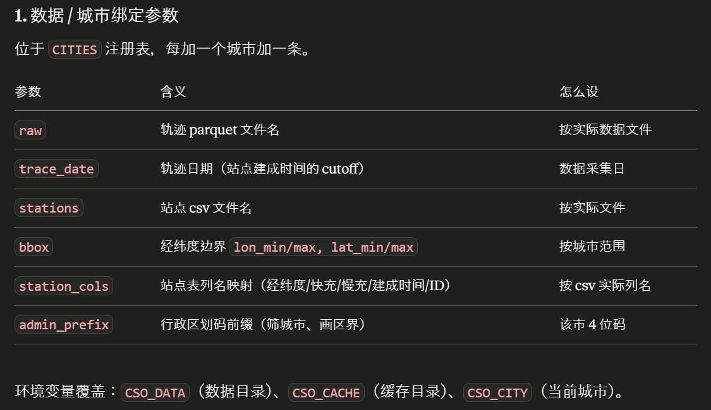
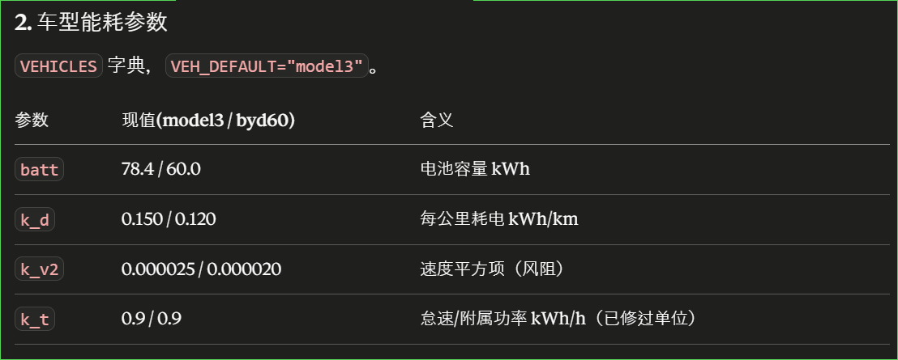
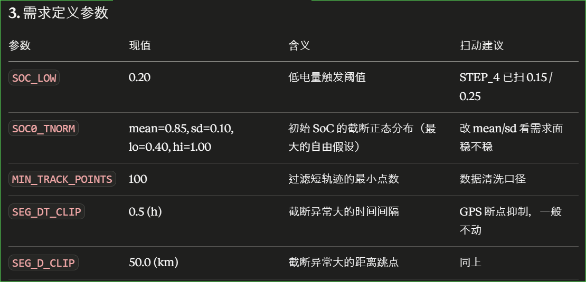
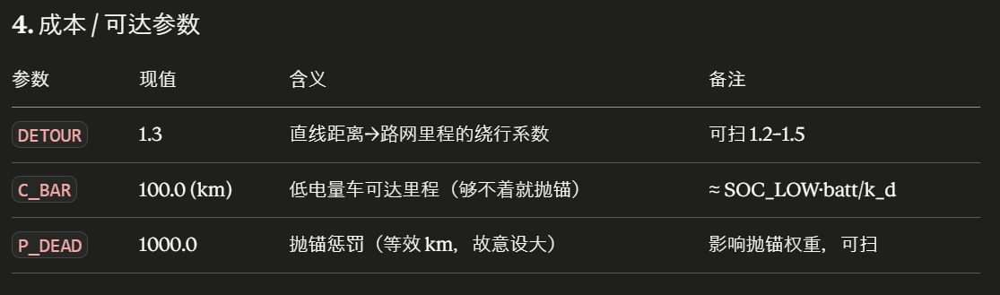
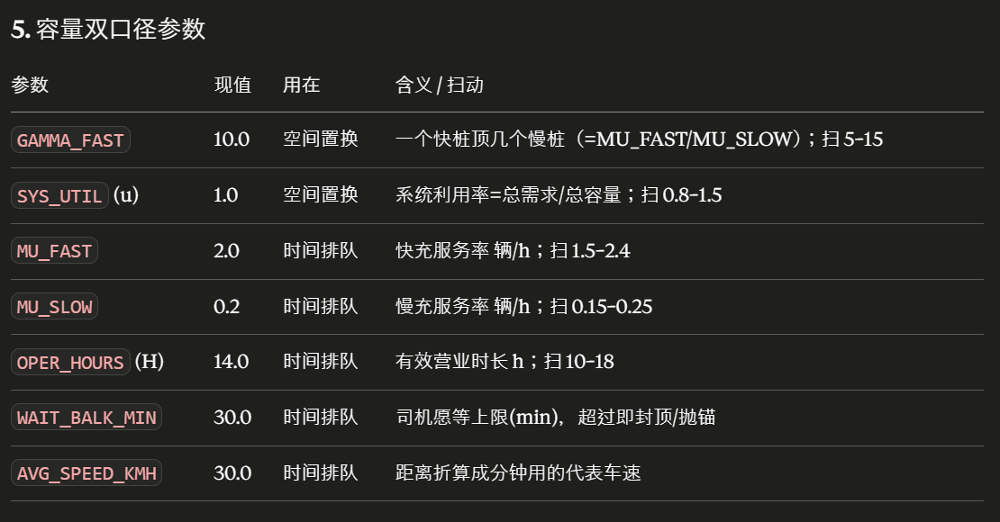
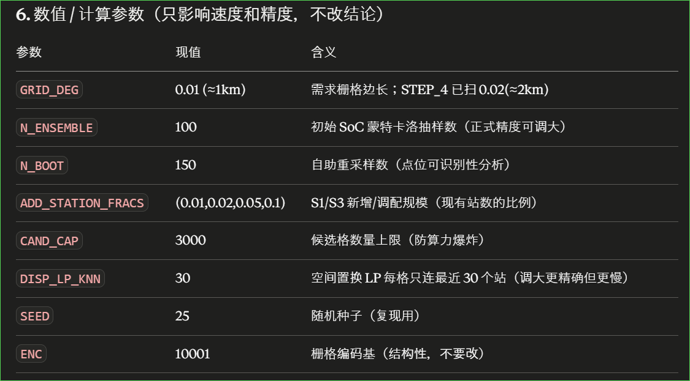

# 充电站错配指数 M(F)

---

## 1. 原指数的缺陷

原指数为

$$
M_{\text{old}}(F)=\sum_{i\in D} w_i\,\big(\min_{j\in F}c_{ij}\big)\,\mathbf 1[\min_j c_{ij}\le \bar C]
\;+\;P_{\text{dead}}\sum_{i\in D} w_i\,\mathbf 1[\min_j c_{ij}> \bar C]. \tag{1}
$$

它把每个需求格 i 指派给唯一的最近开放站，并隐含假设该站吞吐无限。会出现问题：

1. 目标值只由"每个格的最近站是谁"决定。一个不是任何格最近站的新站，边际贡献恒为 0。于是模型在结构上只需要约 |D| 个站
2. 在一个已严重超载的热点旁再建一个站，模型只承认它把桩拉近了这一点距离收益，看不到分担需求、缓解拥挤的收益。
3. 错配指数被压成"能到达/ 抛锚"两部分，无法区分"抛锚"与"在距离范围内但站点容量满了/等待时间过长"这两种失配。

---

## 2. 第二代错配指数 M(F)

加入考虑充电站会满，但站满之后司机怎么办的数据缺失，于是从两个角度各算一遍。

- 空间置换（Spatial-displacement）：司机改道去稍远的空站，M(F)代价是多走路，单位 km。
- 时间排队（Temporal-queueing）：司机非最近站不去、宁可排队，M(F)代价是多等时间，单位分钟。

如果 S1 只增 / S2 只减 / S3 等量调配 的结论在两个口径下都成立，结论在改道还是排队下都成立。

## 3. 符号

---

## 4. 站点有效容量

快充桩单位时间服务的车比慢充桩多，按充电功率比 γ 给快桩加权，定义站点 j 有效容量 κ_j ：

$$
\kappa_j=\gamma\, n_j^{\text{fast}}+n_j^{\text{slow}}. \tag{2}
$$

低电量车在快充约 25–40 min 充好（≈2 辆/h），慢充要数小时（≈0.2 辆/h），本文γ取值=10。

| 来源                                                         | 快慢充参数                                                   | 比值                                                         |
| ------------------------------------------------------------ | ------------------------------------------------------------ | ------------------------------------------------------------ |
| **Nature Communications, 2025**，Hanig et al., *Finding gaps in the national electric vehicle charging station coverage of the United States*。([Nature](https://www.nature.com/articles/s41467-024-55696-8)) | 慢充：Level 2 = 5–19.2 kW；快充：DCFC = 50–350 kW。          | 按功率直接折算：最低 50/19.2=2.60，最高 350/5=70.00。        |
| **Journal of Energy Storage, 2025**，Mojlish et al., *Impacts of ultra-fast charging of electric vehicles on power grids*。([ScienceDirect](https://www.sciencedirect.com/science/article/pii/S2352152X24044992)) | 慢充：Level 2 AC = 3.1–19.2 kW，7–10 h；快充：Level 3 DC = 50–250 kW，30 min。 | 按功率：(50/19.2=2.60) 到 (250/3.1=80.65)。按时间服务率：(7/0.5=14) 到 (10/0.5=20)。 |
| **Sustainable Cities and Society, 2025**，Rajabi et al., *Strategic deployment of Level-2 charging infrastructure*。([ScienceDirect](https://www.sciencedirect.com/science/article/pii/S2210670725003919)) | 慢充：Level 2 = 4–8 h full charge；快充：DCFC = 30 min or less to 80%。 | 按服务时间：(4/0.5=8) 到 (8/0.5=16)。                        |

---

## 5. 空间置换 和 时间排队

司机要么开去稍远的空站，要么就地排队。现实是两者的混合，从这两个极端各算一遍：

- 空间置换（Spatial-displacement） 把拥堵全算成绕路，假设司机总能改道去空站（单位 km）。
- 时间排队（Temporal-queueing） 把拥堵全算成等待，假设司机非最近站不去（单位分钟）。

### 5.1 空间置换

把每个格的需求分配到可达范围内的站；每个站能接纳的需求量有上限 b_j；装不下的被挤到更远的可达站；无处可去计为失配。

是让全部需求总出行最短的意义下求最优分配，就是假设有个统一调度让总成本最小，看布局本身最好能支持到什么程度，不是预测每个司机怎么选。因为这是目前的布局理论上能做到的最好结果，真实情况各自为政的选择只会更差：
$$
\boxed{\;
M^{\text{disp}}(F)=\min_{x\ge 0}\;\sum_{i}\sum_{j} w_i\,c_{ij}\,x_{ij}\;+\;P_{\text{dead}}\sum_{i} w_i\,x_{i0}
\;}
\tag{3}
$$

$$
\text{s.t.}\quad
\sum_{j} x_{ij}+x_{i0}=1\ \ \forall i,\qquad
\sum_{i} w_i\,x_{ij}\le b_j\ \ \forall j,\qquad
x_{ij}=0\ \text{若}\ c_{ij}>\bar C .
$$

其中 x{ij} 是"格 i 的需求里去站 j 的比例"，x{i0} 是"得不到服务的比例"。这是线性规划问题（在多个线性的等式或不等式约束条件下，寻找某个线性目标函数最大值或最小值的数学优化方法）。

> **实现说明：** 用成熟的线性规划求解器（`scipy.optimize.linprog` 的 HiGHS 引擎）求解。为控制问题规模，每个需求格只连"最近的若干个（这里`DISP_LP_KNN`参数设置为 30 ）可达站"；最优分配几乎不会跨过这么多更近的站去远处，与"连全部可达站"的精确解差异可忽略。

b_j 为容量，比例常数 s 为一个等效桩在城市各处每天需要消化的需求量。 u 为系统利用率（= 总需求 ÷ 总容量），

$$
b_j=s\,\kappa_j,\qquad s=\frac{\sum_{i} w_i}{u\,\sum_{j}\kappa_j}. \tag{4}
$$

### 5.2 时间排队

把每个站看成排队系统：c_j 个桩（服务台）、车随机到达、每辆充电时长随机，可代入排队论里的 M/M/c 模型（到达随机、服务时长随机、c 个并行服务台），算出在给定客流下平均要排队等多久。这时司机的充电总代价为"路上时间 + 排队时间"，这里的单位我使用分钟会更加直观一点（e.g. 4min / 0.067h)：

$$
g_{ij}=\underbrace{60\, \frac{c_{ij}}{\bar v}}_{\text{路上时间(分钟)}}+\underbrace{W_q^j(\lambda_j)}_{\text{排队时间(分钟)}} . \tag{5}
$$

排队时间用排队论Erlang-C 公式算平均等待时间。定义利用率 ρ_j 和 强度 a_j
$$
\rho_j=\frac{\lambda_j}{c_j\mu}（每小时来车辆 ÷ 总服务能力，等于1排队无穷长）；a_j=\frac{\lambda_j}{\mu}
$$
则Erlang-C 公式：

$$
W_q^j=\frac{\Pi_j}{c_j\mu-\lambda_j},\qquad
\Pi_j=\frac{\dfrac{a_j^{\,c_j}}{c_j!\,(1-\rho_j)}}{\displaystyle\sum_{k=0}^{c_j-1}\frac{a_j^{\,k}}{k!}+\frac{a_j^{\,c_j}}{c_j!\,(1-\rho_j)}} . \tag{6}
$$

Π\_i 为到充电站时，充电桩全忙的概率。此时错配函数为：

$$
M^{\text{queue}}(F)=\min_{x\ge 0}\;\sum_{i}\sum_{j} w_i\,g_{ij}\,x_{ij}\;+\;P_{\text{dead}}\sum_{i} w_i\,x_{i0},\quad
\lambda_j=\frac{\Big(\textstyle\sum_i w_i x_{ij}\Big)}{H}. \tag{7}
$$

> **说明：** 空间置换作为指标看最乐观的情况，因为真实情况带入算出来的值很容易会比其代价更大；时间排队（`compute_M_queue`）则当偏悲观的参照，此时代码里不去解(7) 的系统最优，而是直接用最近站就地排队最固执（悲观）的行为来算。真实情况代入算出来的值很容易会比其代价更小。代码中设置了司机愿意排队的上限（`WAIT_BALK_MIN`，这里取 30 min）

### 5.3 两个指标并列报告 

最终把两个指标并列报告 
$$
\big(M^{\text{disp}}(F),\,M^{\text{queue}}(F)\big)
$$
两个数各自是一个诊断，选址优化与双口径的衔接见 §7。

---

## 6. 两类失配的分解

无论空间置换还是时间排队口径，最优值都能拆开，且失配可再分成因：

$$
M(F)=\underbrace{\sum_{i,j} w_i\,(\text{距离或时间})\,x_{ij}^{*}}_{M_{\text{access}}}
+\underbrace{P_{\text{dead}}\sum_{i} w_i\,x_{i0}^{*}}_{M_{\text{dead}}},\qquad
M_{\text{dead}}=M_{\text{dead}}^{\text{range}}+M_{\text{dead}}^{\text{capacity}}. \tag{8}
$$

- M_access：需求的出行/等待成本；M_rang：可达内无站；**M_capacity：可达内有站但容量被占满/等待超阈，为容量失配。**

---

## 7. 与原错配模型

容量不再约束时，两个公式都退回每个格指派给可达内最近站，即
$$
M^{\text{disp}},\,M^{\text{queue}}\ \longrightarrow\ \sum_i w_i\big(\min_j c_{ij}\big)\mathbf 1[\cdot]+P_{\text{dead}}\sum_i w_i\mathbf 1[\cdot]=M_{\text{old}}(F). \tag{9}
$$

---

## 8. 参数

---

## 9. Ref

[1] Hakimi, S. L. (1964). Optimum locations of switching centers and the absolute centers and medians of a graph. *Operations Research*, 12(3), 450–459. ——邻近指派 / p-中位基底：式 (1)(9)

[2] ReVelle, C. S., & Swain, R. W. (1970). Central facilities location. *Geographical Analysis*, 2(1), 30–42. ——p-中位公式化（原指数谱系）：式 (1)(9)

[3] Hitchcock, F. L. (1941). The distribution of a product from several sources to numerous localities. *Journal of Mathematics and Physics*, 20(1–4), 224–230. ——运输问题（容量指派求解原型）：式 (3)

[4] Mulvey, J. M., & Beck, M. P. (1984). Solving capacitated clustering problems. *European Journal of Operational Research*, 18(3), 339–348. ——容量受限选址/聚类：式 (3)(4)

[5] Daskin, M. S. (2013). *Network and Discrete Location: Models, Algorithms, and Applications* (2nd ed.). Wiley. ——容量受限设施选址（综述/教科书）：式 (3)(4)

[6] Luo, W., & Wang, F. (2003). Measures of spatial accessibility to health care in a GIS environment. *Environment and Planning B*, 30(6), 865–884. ——两步移动搜索 / 供需比：§4 诊断

[7] Luo, W., & Qi, Y. (2009). An enhanced two-step floating catchment area (E2SFCA) method for measuring spatial accessibility to primary care physicians. *Health & Place*, 15(4), 1100–1107. ——供需比 / 距离衰减：§4 诊断

[8] Upchurch, C., Kuby, M., & Lim, S. (2009). A model for location of capacitated alternative-fuel stations. *Geographical Analysis*, 41(1), 85–106. ——加油/充电站容量约束：式 (2)(3)

[9] Marianov, V., & Serra, D. (2002). Location–allocation of multiple-server service centers with constrained queues. *Annals of Operations Research*, 111, 35–50. ——排队（M/M/c）型选址：式 (5)(6)(7)

[10] Gross, D., Shortle, J. F., Thompson, J. M., & Harris, C. M. (2008). *Fundamentals of Queueing Theory* (4th ed.). Wiley. ——M/M/c 与 Erlang-C 等待公式：式 (6)

[11] Sheffi, Y. (1985). *Urban Transportation Networks: Equilibrium Analysis with Mathematical Programming Methods*. Prentice-Hall. ——系统最优 / 凸配流与 Frank–Wolfe 解法：式 (3)(7)

[12] Alumur, S. A., et al. (2024). Charging station location and sizing for electric vehicles under congestion. *Transportation Science* (articles in advance). doi:10.1287/trsc.2021.0494. ——容量/规模在充电选址中的重要性，排队服务标准（动机）：§1, §5

[13] Nemhauser, G. L., Wolsey, L. A., & Fisher, M. L. (1978). An analysis of approximations for maximizing submodular set functions—I. *Mathematical Programming*, 14(1), 265–294. ——贪心 (1-1/e) 界：式 (10)
